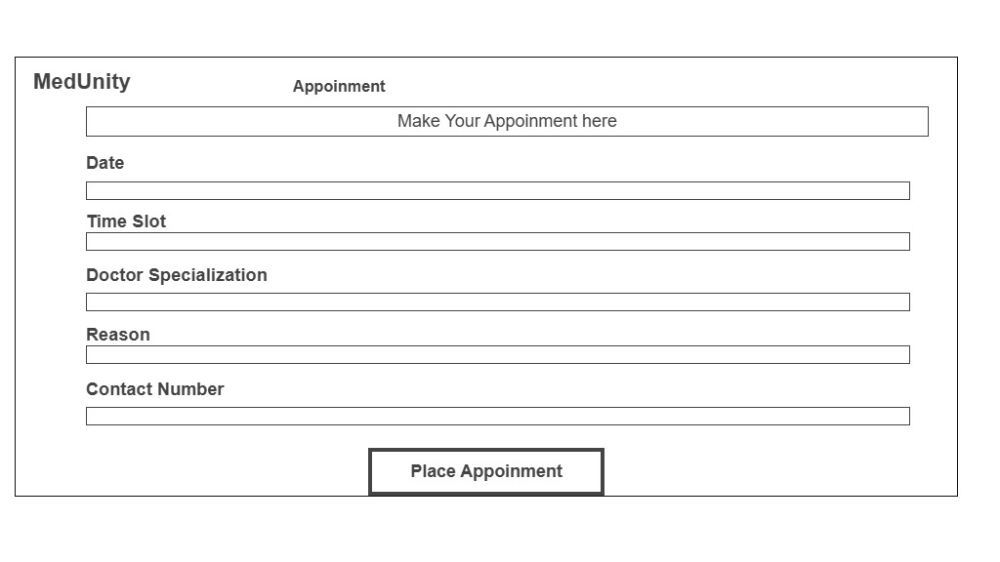
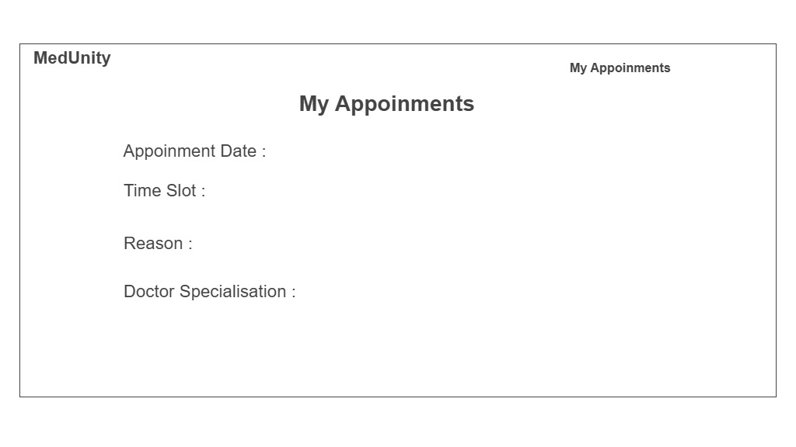

# 🏥 MedUnity – Healthcare Appointment Management System


MedUnity is a cloud-based healthcare appointment management system built using **ASP.NET Core Razor Pages**.  
The platform enables patients to book and track appointments while providing access to **admin-approved wellness updates with verified source links**.

This project was developed for **HackMS 2026**, where it secured **🏆 4th place** for its real-world relevance, system design, and usability.

---

## 🏆 Hackathon Achievement

- **Event:** HackMS 2026  
- **Result:** 🥉 **4th Place**  
- **Evaluation Criteria:**  
  - Problem relevance  
  - Technical implementation  
  - UI/UX design  
  - Innovation and impact  

---

## 🚀 Tech Stack


- **Backend:** ASP.NET Core (C#) – Razor Pages  
- **Frontend:** HTML, CSS, Bootstrap  
- **Database:** SQL Server  
- **Deployment:** Microsoft Azure  

---

## ✨ Key Features

### 👤 Patient Features
- Secure authentication
- Book healthcare appointments
- View appointment history and status
- Access verified wellness updates
- Clean, responsive UI

### 🛠️ Admin Features
- View and manage all patient appointments
- Update appointment status (Pending / Completed / Rejected)
- Add rejection reasons for transparency
- Create and manage wellness updates
- Control and verify health-related content

---

## 🌱 Wellness Updates (Trust & Transparency)

MedUnity includes a **Wellness Update section** that works as a curated health information feed.

- All wellness content is **reviewed and approved by administrators**
- Each update includes **source links** to trusted medical or health-related websites
- Ensures patients receive **accurate, verified, and reliable information**
- Helps prevent misinformation while promoting preventive healthcare

> *All wellness updates on MedUnity are admin-approved and include source references for verification.*

---

## 📸 Wireframes

### 🏠 Home Page


### 🔐 Login Page


### 📅 Book Appointment


### 📋 My Appointments


### 🧘 Manage Wellness Updates (Admin)


---

## 🗂️ System Design

### ER Diagram


---

## 🔐 Login Credentials (Demo Accounts)

Use the following demo accounts for testing and evaluation:

### 👤 Patient Account
- **Email:** `patient@email.com`
- **Password:** `patient`

### 🛠️ Admin Account
- **Email:** `admin@email.com`
- **Password:** `admin`

> These accounts are provided for demonstration purposes only.

---

## 🗄️ Local Database Setup (Data Seeding)

When running the project **locally**, initial data such as demo users and sample appointments must be seeded.

### 🔧 Steps to Enable Seeding

1. Open `Program.cs`
2. Locate the following code block:
```csharp
// using (var scope = app.Services.CreateScope())
// {
//     var context = scope.ServiceProvider.GetRequiredService<AppDbContext>();
//     DbSeeder.SeedData(context);
// }
