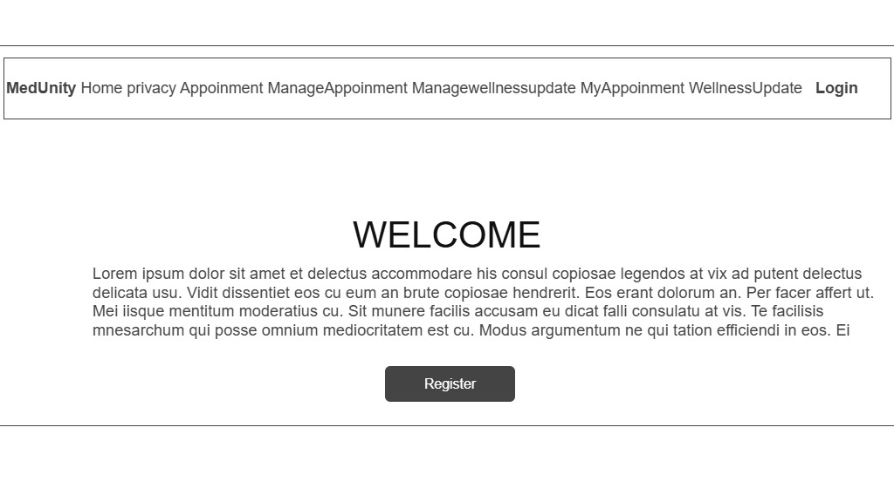
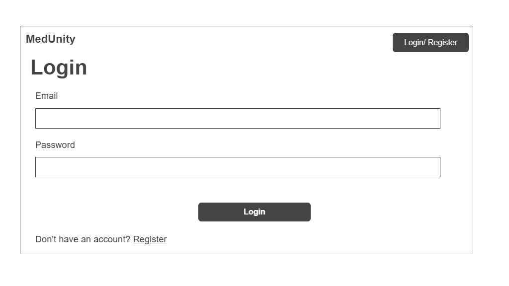
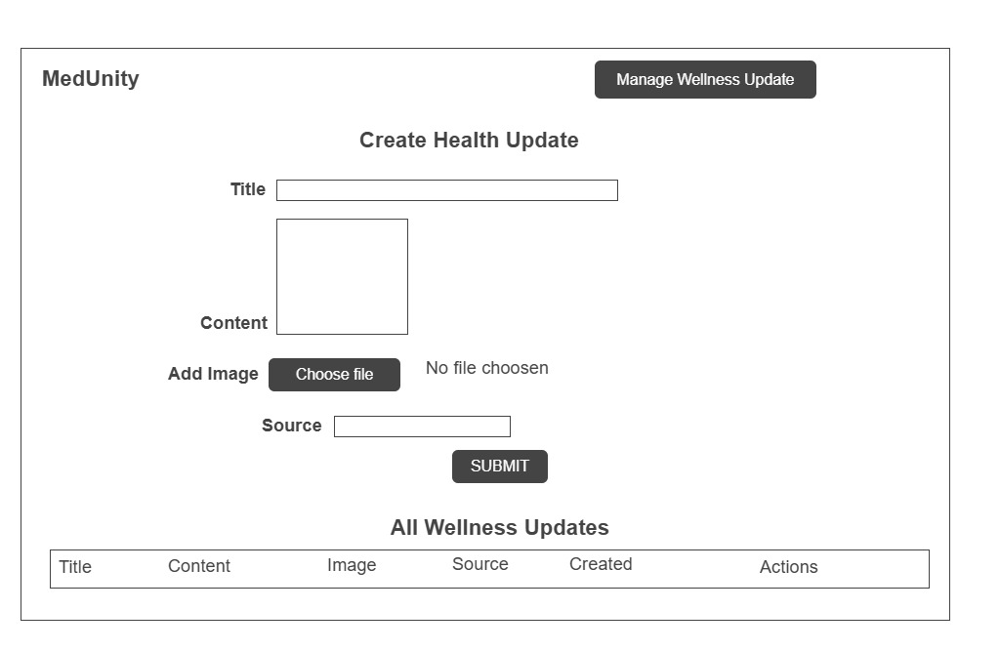

# 🏥 Healthcare Appointment Management System

A web-based healthcare appointment management system built using **ASP.NET Core Razor Pages**.  
This project allows users to book appointments, manage wellness data, and view appointment history through a clean and responsive UI.

---

## 🚀 Tech Stack


- **Backend:** .NET (C#) – Razor Pages  
- **Frontend:** HTML, CSS, Bootstrap  
- **Database:** SQL Server  
- **Deployment:** Microsoft Azure  

---

## ✨ Features

- User authentication (Login)
- Book healthcare appointments
- View and manage appointments
- Update wellness information
- Responsive UI using Bootstrap
- Secure database integration

---

## 📸 Screenshots

### 🏠 Home Page


### 🔐 Login Page


### 📅 Book Appointment


### 📋 My Appointments


### 🧘 Manage Wellness Update


---

## 🗂️ System Design

### ER Diagram


---

---

## 🔐 Login Credentials

Use the following demo accounts to access the system:

### 👤 Patient Account
- **Email:** `patient@email.com`
- **Password:** `patient`

### 🛠️ Admin Account
- **Email:** `admin@email.com`
- **Password:** `admin`

> These accounts are provided for testing and demonstration purposes only.


## 🗄️ Local Database Setup (Data Seeding)

When running the project **locally**, you need to seed initial data (admin, patient, sample appointments).

### 🔧 Steps

1. Open `Program.cs`

2. **Uncomment** the following code block:

```csharp
using (var scope = app.Services.CreateScope())
{
    var context = scope.ServiceProvider.GetRequiredService<AppDbContext>();
    DbSeeder.SeedData(context);
}